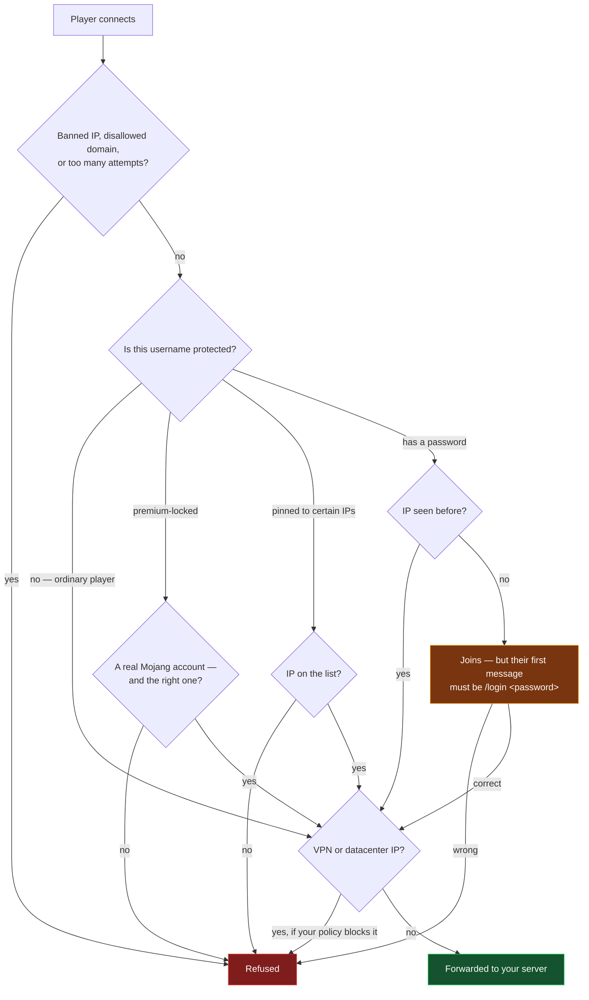
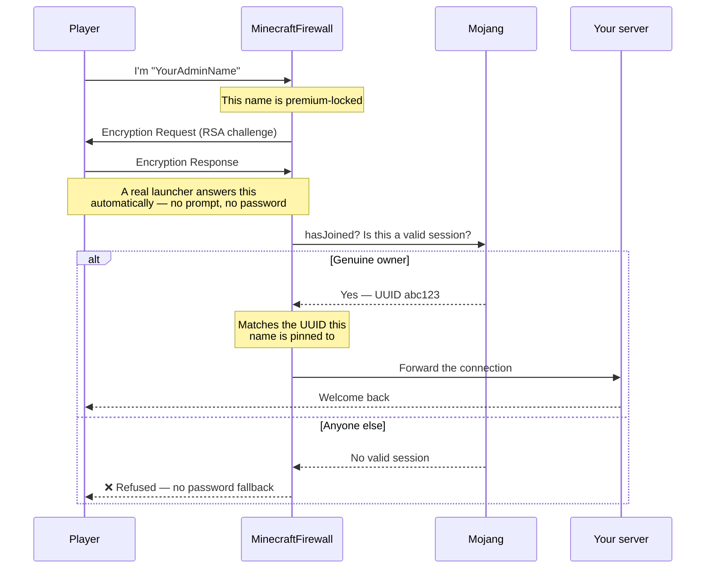

<p align="center">
  
</p>

<p align="center">
  
  
  
  
</p>

If you run a Minecraft Java server with `online-mode=false`, Minecraft never checks who anyone is.
Anyone can type your admin's username and join as them. **MinecraftFirewall** sits in front of your
server and decides, per connection, who actually gets through — with no plugin or mod inside Minecraft
at all.

It can even lock a username to its **real Microsoft/Mojang account** while your server stays in offline
mode. The genuine owner joins normally and is never asked for a password; everyone else is refused.

---

## Quick start

**1.** Download **`MinecraftFirewall-setup.exe`** from
[Releases](https://github.com/CaYatur/MinecraftFirewall/releases) and run it. It installs the
background service, sets it to start with Windows, and puts a control panel in your Start Menu.
Nothing else needs installing first — not even .NET.

**2.** In your server's `server.properties`, move the real server out of the way and hide it:

```properties
server-ip=127.0.0.1
server-port=25566
```

> This is the single most important step. The firewall protects nothing if players can still reach
> your server directly. Once you have done it, the control panel's **Security check** page will
> confirm it for you — it genuinely tries to connect, rather than taking your word for it.

**3.** Open the control panel, go to **Servers**, and point it at your server:

<p align="center">
  
</p>

**4.** Press **Save and restart service**. Players keep connecting to your normal address on port
`25565` — nothing changes for them.

**5.** Run the **Security check**. Four green rows mean the firewall is genuinely in front of your
server rather than beside it:

<p align="center">
  
</p>

<details>
<summary><b>Prefer to run it by hand, without the installer?</b></summary>

Download the plain zip from Releases instead, unzip it somewhere permanent, edit `appsettings.json`
directly, and run:

```bash
MinecraftFirewall.Proxy.exe
```

```
[10:14:02 INF] [MyServer] listening on port 25565, forwarding to 127.0.0.1:25566.
[10:14:03 INF] Refreshed .../output/vpn/ipv4.txt (6567 ranges).
[10:14:03 INF] Refreshed .../output/datacenter/ipv4.txt (29062 ranges).
```

Run it **as Administrator** for real machine-wide firewall bans. Without elevation everything still
works, but repeat offenders are only blocked inside the proxy — it says so clearly at startup. To keep
it running permanently:

```bash
sc.exe create MinecraftFirewall binPath= "\"C:\MinecraftFirewall\MinecraftFirewall.Proxy.exe\"" start= auto
```

The inner quotes are not a typo: without them Windows stores an unquoted service path, which is a
privilege-escalation hazard whenever the path contains a space.

</details>

---

## The control panel

Everything is manageable from the app — you never have to edit JSON unless you want to.

<p align="center">
  
</p>

| Page | What it answers |
|---|---|
| **Status** | Is protection running? Start, stop, install or remove the service; see live activity. |
| **Servers** | Which servers am I fronting, on which ports, with which protected usernames? |
| **Security check** | Can anyone reach past me to the real server? |
| **Protection** | What is the firewall holding off right now? Every defence layer, with switches. |
| **Blocked IPs** | Who is banned right now, and until when? Unban with one click. |
| **Activity log** | What just happened? The service's own log, tailed live. |
| **Settings** | Language, start-up behaviour, and the optional features that are off by default. |

English and Turkish, switchable without restarting:

<p align="center">
  
</p>

It also lives in the system tray, so closing the window leaves protection running.

---

## Layers of defence

Identity is only the first question. Everything below runs whether or not a username is protected.

<p align="center">
  
</p>

| Layer | What it stops | Default |
|---|---|---|
| **Admission control** | Connection floods. Separate caps per address, per /24, per minute, and overall — because a botnet spread across one subnet is invisible per-address and obvious per-subnet. | On |
| **Bot scoring** | Automated joins. Logging in without ever asking for the server list, working through a list of usernames, reconnecting on a metronome. | On, **reports only** |
| **Deep inspection** | Packets no Minecraft client sends: impossible coordinates, oversized frames, malformed plugin messages, and Log4j-style payloads in chat, usernames, signs and books. | On |
| **Decoy ports** | Port scanners. Nothing advertises these ports, so anything touching one is enumerating rather than playing. | Off |
| **Threat lists** | Addresses seen attacking elsewhere, imported from public feeds. | On, **scores only** |
| **Anomaly detection** | Whatever the rules above did not anticipate. Learns the shape of ordinary connections to *your* server and reports what does not fit. | Off, **reports only** |

Three of those ship deliberately switched off or limited to reporting, and it is worth saying why
rather than leaving it looking like an oversight.

**Bot scoring** starts in report-only mode because nobody knows what your server's own traffic scores
until they have watched it for a few days. Turning a heuristic loose before that is how a firewall
ends up refusing its owner. Watch the Activity log, then switch it to refuse.

**Movement analysis** reports and does not kick. This proxy sees coordinates and nothing else — not
ice, boats, elytra, riptide tridents, speed potions, or a plugin teleporting somebody. All of those
look exactly like a speed cheat from here. A server-side anti-cheat plugin has the world state to tell
them apart; this does not. What it *does* enforce by default is coordinates that are not numbers at
all — NaN, infinity, positions outside the world — because those are crash inputs, not cheats, and no
client produces them by playing.

**Anomaly detection** is off because it learns from live traffic, which means an attacker present
during the learning window becomes part of the baseline. Switch it on at a quiet time. It never
refuses anyone, and there is no setting to change that: what it detects is "unlike your other
connections", which is not the same claim as "malicious".

### Injection payloads

Log4Shell reached Minecraft servers through chat, and the reason it worked is still true: player text
ends up in log formatters, plugin config parsers and web panels, each a different interpreter. This
scans chat, commands, usernames, signs and books — signs and books included because a payload written
into one persists in world data long after the connection that delivered it.

The scan de-obfuscates rather than pattern-matches. Log4j's lookup syntax lets `${jndi:...}` be
written as `${${::-j}${::-n}${::-d}${::-i}:...}`, which no search for "jndi" will ever find, so the
text is stripped of the syntax that does the obfuscating and the search runs on what is left. That
inverts the problem: instead of enumerating obfuscations, it removes the tools used to build them.

---

## What happens to a connection



An unprotected name behaves exactly like vanilla offline mode — the gate only runs for names someone
has actually opted into protecting. Everything past this point is relayed byte-for-byte, so your
server behaves exactly as it always did.

---

## Premium account lock

This is the headline feature. Mark a username as premium and it belongs to one real Microsoft account,
permanently — even though your server never leaves offline mode.

```jsonc
{ "Username": "YourAdminName", "RequirePremium": true }
```



**What this means in practice**

| | |
|---|---|
| The real owner | Joins normally from any IP. Never sees a password prompt, ever. |
| A cracked client | Refused. It cannot answer the cryptographic challenge. |
| Someone with a *different* real account | Refused — the name is pinned to one UUID. |
| Mojang is down | Refused, deliberately. Falling back to "let them in" would defeat the point. |

> The first account to successfully verify claims the name **permanently**. Set this up before someone
> else takes the name — it can't retroactively un-claim a name an attacker already grabbed.

---

## Everything it does

| Feature | What it's for |
|---|---|
| 🔐 **Premium account lock** | Bind a username to its real Microsoft account, on an offline-mode server. |
| 🧾 **CaYaDev-Check** | Self-service `/register` and `/login` for any player. PBKDF2 hashed, remembers known IPs so nobody is nagged twice. |
| 📋 **Protected usernames** | Pin a name to specific IPs or CIDR ranges. Unknown IP is a hard refusal. |
| 🌐 **VPN & datacenter blocking** | Free MIT-licensed IP lists, refreshed daily, cached to disk. Optional real-time ipinfo.io lookup on top. |
| 🚪 **Allowed domains** | Only accept players arriving through your domain — IP-scanning bots get nothing. |
| ⛔ **Real firewall bans** | Repeat offenders get a genuine machine-wide Windows Firewall rule, with an expiry that survives restarts. |
| 🕵️ **Command auditing** | Play-state commands are logged and checked against a dangerous-command list. |
| 🚦 **Rate limiting** | Separate sliding windows for server-list pings and login attempts. |
| 💬 **Discord alerts** | Optional webhook for bans, new trusted IPs, and failed premium checks. |
| 🖥️ **Multi-server** | One process in front of as many servers as you like, each on its own port. |
| 🗣️ **Every message editable** | All player-facing text lives in config. English by default, Turkish example included. |

---

## What players actually see

A player registering a password for their name:

```
[10:22:15 INF] [MyServer] login allowed for 'Steve' from 203.0.113.44.
[10:22:16 INF] [MyServer] 'Steve' registered with CaYaDev-Check from 203.0.113.44.
```

Someone trying that same name from a new IP without the password:

```
[10:31:07 WRN] [MyServer] grace-authentication FAILED for 'Steve' from 198.51.100.9
               — first message was not a correct /login.
```

A cracked client going after a premium-locked name:

```
[10:44:51 INF] Mojang hasJoined check for 'YourAdminName' found no valid session — denying.
[10:44:51 WRN] [MyServer] premium verification FAILED for 'YourAdminName' from 198.51.100.9
```

The player sees a normal Minecraft kick screen with whatever wording you configured.

---

## Configuration

Everything lives in `appsettings.json`. Every section is optional — leave one out and sensible defaults
apply.

| Section | What it controls |
|---|---|
| `ServerProfiles` | Your servers, ports, protected usernames, allowed domains. **The only section you must edit.** |
| `Messages` | Every kick/disconnect message. English defaults; a Turkish block ships commented out. |
| `Premium` | Master switch for premium verification (on by default, needs no API key). |
| `VpnIntel` / `IpInfo` | VPN list sources; optional ipinfo.io token for the real-time signal. |
| `RateLimit` / `FirewallBan` / `NeverBan` | Thresholds, ban duration, and IPs that can never be banned. |
| `Alerts` | Discord webhook URL and which events to report. Off until you add a URL. |
| `DdosProtection` | Per-address, per-subnet and overall connection limits, and the defensive mode. |
| `BotDefense` | Signal weights and whether a high score reports or refuses. |
| `DeepInspection` | Packet size and rate caps, injection scanning, movement analysis. |
| `Honeypot` | Decoy ports. Off by default; ports are pre-filled. |
| `ThreatIntel` | Imported public threat feeds, and where this machine writes its own findings. |
| `AnomalyDetection` | The learned baseline. Off by default, and reports only. |
| `IdentityPersistence` | Where learned passwords, IPs and premium pins are stored between restarts. |

### Turkish messages

Open the `Messages` section — a full Turkish translation ships commented out. Swap the values in and
restart:

```jsonc
"Messages": {
  "GenericDenied": "Bu bağlantı MinecraftFirewall tarafından engellendi.",
  "HostnameNotAllowed": "Bu sunucuya sadece izin verilen adres(ler) üzerinden bağlanılabilir.",
  "GraceAuthenticationFailed": "Kimlik doğrulama başarısız. Bu IP tanınmıyor ve doğru şifre girilmedi."
}
```

---

## Admin CLI

Run **elevated** — the control pipe refuses non-Administrator connections outright.

```bash
MinecraftFirewall.Admin.exe list-bans
MinecraftFirewall.Admin.exe unban 203.0.113.7
MinecraftFirewall.Admin.exe list-profiles
MinecraftFirewall.Admin.exe whitelist-add-me MyServer YourAdminName 203.0.113.7
MinecraftFirewall.Admin.exe require-premium MyServer YourAdminName
MinecraftFirewall.Admin.exe reload
MinecraftFirewall.Admin.exe defense-status
MinecraftFirewall.Admin.exe list-threats
```

> **`require-premium` must be followed up in `appsettings.json` straight away.** Every other command
> lapsing on restart just denies someone — safe. This one lapsing leaves the name **open to anyone
> again**. Add `"RequirePremium": true` in the same sitting.

`reload` only refreshes the VPN/datacenter IP lists. Ports and profiles still need a restart.

---

## Honest limitations

This section is deliberately not marketing copy. Read it before relying on any of this.

- **This is defence in depth, not Mojang authentication.** It raises the cost of impersonation
  enormously; it does not make an offline-mode server equivalent to an online-mode one.
- **Premium lock protects a name from the moment you enable it.** It cannot take back a name an
  attacker already claimed in plain offline mode beforehand.
- **Your server must be unreachable directly.** If players can still connect to port `25566`, none of
  this applies to them. Verify it yourself; the proxy cannot check this for you.
- **`AllowedHostnames` is not a cryptographic boundary, and cannot be made into one.** The hostname is
  whatever string the client chose to send; nothing binds it to how the connection was actually made.
  A stock client pointed at your raw IP is correctly refused, and so is the bulk of IP-scanning
  traffic — but a custom client that simply *lies* about the field walks straight past it, and no
  amount of work on this check changes that. Two things were done about it instead. A refused mismatch
  now counts towards the address's bot score, so an address that keeps trying is treated as
  enumerating rather than being forgotten between connections. And the control that genuinely enforces
  "only through my domain" is stated plainly: your real server being unreachable except from this
  proxy, which is exactly what the Security check page tests. For a hard guarantee at the network
  level, put a TCP-fronting proxy (Cloudflare Spectrum, TCPShield) in front and firewall the public
  port to its IP ranges.
- **Movement analysis is advisory, not anti-cheat.** See the layers table above. Crash inputs are
  blocked; "moved too fast" is reported, because this proxy cannot see the ice, boat, elytra or plugin
  teleport that would explain it.
- **Anomaly detection learns from live traffic**, so an attacker present during its learning window
  becomes part of the baseline. Only connections that ended cleanly and were never struck are learned
  from, and a few hundred are required before it says anything — but that narrows the problem rather
  than removing it.
- **The bot score is beatable, and its weights say how.** A bot that sends one status ping before each
  login defeats the highest-weighted signal for a one-line change. The others exist because it then
  still has to use one username and reconnect at human intervals, which costs considerably more. The
  arithmetic of what actually reaches the refusal threshold is written into `appsettings.json` rather
  than left for you to discover.
- **Your server still sees its own offline UUID** for a premium-verified player, not their real one.
  Verification is authoritative for *access*, not for what your world files record.
- **The identity store holds password hashes.** They're PBKDF2, not plaintext, but don't hand the file
  around. Deleting it un-pins every premium name.
- **Two things were never tested in this project's build environment**, and are called out rather than
  glossed over: a *successful* premium login by a genuine Microsoft account (there was no real account
  available — the *refusal* path is verified end-to-end against a live server), and the real Windows
  Firewall COM path (rule creation needs elevation). Both are covered by automated tests; neither was
  observed against the real thing. If you depend on them, verify once yourself.

---

## Building from source

```bash
git clone https://github.com/CaYatur/MinecraftFirewall.git
cd MinecraftFirewall
dotnet test
dotnet run --project src/MinecraftFirewall.Proxy
```

Requires the [.NET 10 SDK](https://dotnet.microsoft.com/download). Windows only — it uses the Windows
Firewall COM API and Windows named-pipe ACLs.

```
src/MinecraftFirewall.Proxy/    The service itself
src/MinecraftFirewall.App/      The control panel (WPF)
src/MinecraftFirewall.Admin/    Companion CLI
installer/                      Inno Setup script + build.ps1 that produces the setup .exe
tests/MinecraftFirewall.Tests/  425 tests — no real server, no admin rights, no real firewall touched
tools/                          Diagnostic client used to verify wire behaviour against a real server
docs/plan.md                    Full design doc: every decision, and how each was verified
```

---

## License

[MIT](LICENSE) — free to use, modify and redistribute.

VPN and datacenter IP data comes from [X4BNet/lists_vpn](https://github.com/X4BNet/lists_vpn), also MIT.
