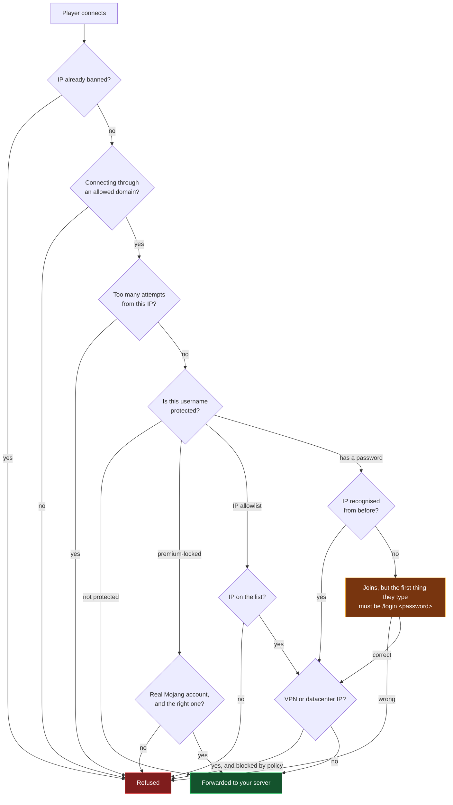
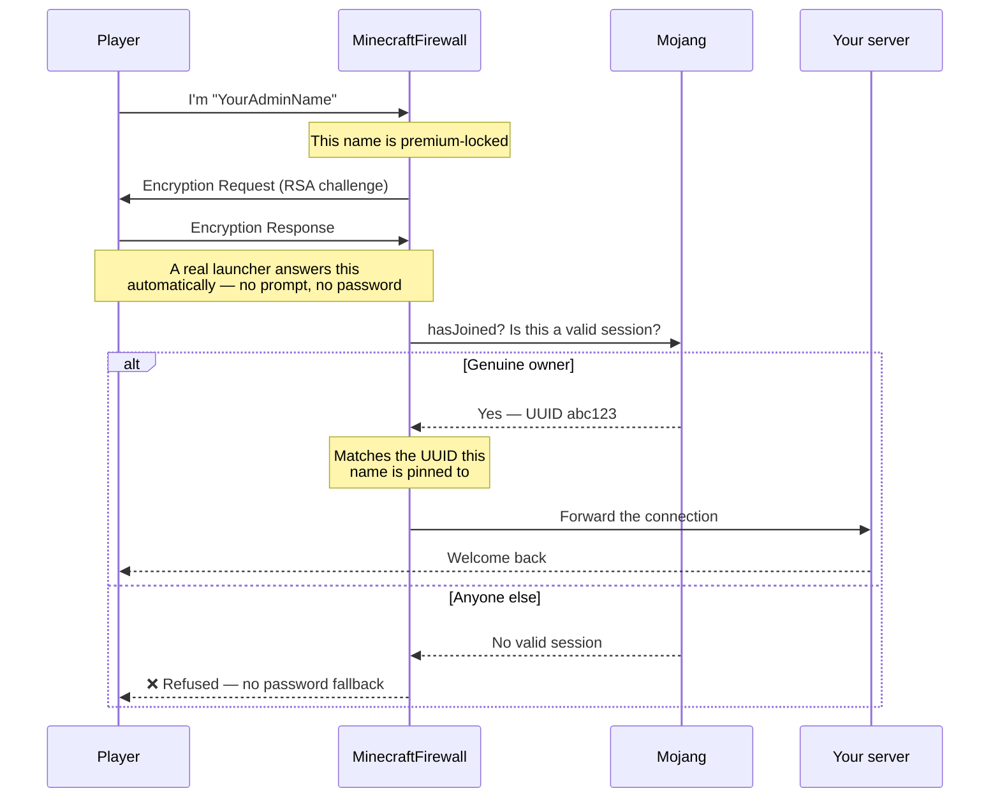

<p align="center">
  
</p>

<p align="center">
  
  
  
  
</p>

If you run a Minecraft Java server with `online-mode=false`, Minecraft never checks who anyone is.
Anyone can type your admin's username and join as them. **MinecraftFirewall** sits in front of your
server and decides, per connection, who actually gets through — with no plugin or mod inside Minecraft
at all.

It can even lock a username to its **real Microsoft/Mojang account** while your server stays in offline
mode. The genuine owner joins normally and is never asked for a password; everyone else is refused.

---

## Quick start

**1.** Download the latest release and unzip it somewhere permanent, e.g. `C:\MinecraftFirewall`.

**2.** In your server's `server.properties`, hide the real server from the internet:

```properties
server-ip=127.0.0.1
server-port=25566
```

> ⚠️ Also make sure port `25566` has **no** router port-forward and **no** inbound firewall rule.
> This is the single most important step — the proxy protects nothing if players can still reach the
> server directly.

**3.** Open `appsettings.json` and point a profile at it:

```jsonc
"ServerProfiles": [
  {
    "Name": "MyServer",
    "PublicPort": 25565,      // what players connect to
    "BackendHost": "127.0.0.1",
    "BackendPort": 25566,     // the real server, from step 2
    "ProtectedUsernames": [
      { "Username": "YourAdminName", "RequirePremium": true }
    ]
  }
]
```

**4.** Start your Minecraft server, then start the firewall:

```bash
MinecraftFirewall.Proxy.exe
```

```
[10:14:02 INF] [MyServer] listening on port 25565, forwarding to 127.0.0.1:25566.
[10:14:03 INF] Refreshed .../output/vpn/ipv4.txt (6567 ranges).
[10:14:03 INF] Refreshed .../output/datacenter/ipv4.txt (29062 ranges).
```

**5.** Players still connect to your normal address on port `25565`. Nothing changes for them.

> **Run it as Administrator** if you want real machine-wide firewall bans. Without elevation everything
> still works, but repeat offenders are only blocked inside the proxy — it says so clearly at startup.

To keep it running permanently, install it as a Windows service:

```bash
sc.exe create MinecraftFirewall binPath= "C:\MinecraftFirewall\MinecraftFirewall.Proxy.exe" start= auto
```

---

## What happens to a connection



Everything after that point is relayed byte-for-byte, so your server behaves exactly as it always did.

---

## Premium account lock

This is the headline feature. Mark a username as premium and it belongs to one real Microsoft account,
permanently — even though your server never leaves offline mode.

```jsonc
{ "Username": "YourAdminName", "RequirePremium": true }
```



**What this means in practice**

| | |
|---|---|
| The real owner | Joins normally from any IP. Never sees a password prompt, ever. |
| A cracked client | Refused. It cannot answer the cryptographic challenge. |
| Someone with a *different* real account | Refused — the name is pinned to one UUID. |
| Mojang is down | Refused, deliberately. Falling back to "let them in" would defeat the point. |

> The first account to successfully verify claims the name **permanently**. Set this up before someone
> else takes the name — it can't retroactively un-claim a name an attacker already grabbed.

---

## Everything it does

| Feature | What it's for |
|---|---|
| 🔐 **Premium account lock** | Bind a username to its real Microsoft account, on an offline-mode server. |
| 🧾 **CaYaDev-Check** | Self-service `/register` and `/login` for any player. PBKDF2 hashed, remembers known IPs so nobody is nagged twice. |
| 📋 **Protected usernames** | Pin a name to specific IPs or CIDR ranges. Unknown IP is a hard refusal. |
| 🌐 **VPN & datacenter blocking** | Free MIT-licensed IP lists, refreshed daily, cached to disk. Optional real-time ipinfo.io lookup on top. |
| 🚪 **Allowed domains** | Only accept players arriving through your domain — IP-scanning bots get nothing. |
| ⛔ **Real firewall bans** | Repeat offenders get a genuine machine-wide Windows Firewall rule, with an expiry that survives restarts. |
| 🕵️ **Command auditing** | Play-state commands are logged and checked against a dangerous-command list. |
| 🚦 **Rate limiting** | Separate sliding windows for server-list pings and login attempts. |
| 💬 **Discord alerts** | Optional webhook for bans, new trusted IPs, and failed premium checks. |
| 🖥️ **Multi-server** | One process in front of as many servers as you like, each on its own port. |
| 🗣️ **Every message editable** | All player-facing text lives in config. English by default, Turkish example included. |

---

## What players actually see

A player registering a password for their name:

```
[10:22:15 INF] [MyServer] login allowed for 'Steve' from 203.0.113.44.
[10:22:16 INF] [MyServer] 'Steve' registered with CaYaDev-Check from 203.0.113.44.
```

Someone trying that same name from a new IP without the password:

```
[10:31:07 WRN] [MyServer] grace-authentication FAILED for 'Steve' from 198.51.100.9
               — first message was not a correct /login.
```

A cracked client going after a premium-locked name:

```
[10:44:51 INF] Mojang hasJoined check for 'YourAdminName' found no valid session — denying.
[10:44:51 WRN] [MyServer] premium verification FAILED for 'YourAdminName' from 198.51.100.9
```

The player sees a normal Minecraft kick screen with whatever wording you configured.

---

## Configuration

Everything lives in `appsettings.json`. Every section is optional — leave one out and sensible defaults
apply.

| Section | What it controls |
|---|---|
| `ServerProfiles` | Your servers, ports, protected usernames, allowed domains. **The only section you must edit.** |
| `Messages` | Every kick/disconnect message. English defaults; a Turkish block ships commented out. |
| `Premium` | Master switch for premium verification (on by default, needs no API key). |
| `VpnIntel` / `IpInfo` | VPN list sources; optional ipinfo.io token for the real-time signal. |
| `RateLimit` / `FirewallBan` / `NeverBan` | Thresholds, ban duration, and IPs that can never be banned. |
| `Alerts` | Discord webhook URL and which events to report. Off until you add a URL. |
| `IdentityPersistence` | Where learned passwords, IPs and premium pins are stored between restarts. |

### Turkish messages

Open the `Messages` section — a full Turkish translation ships commented out. Swap the values in and
restart:

```jsonc
"Messages": {
  "GenericDenied": "Bu bağlantı MinecraftFirewall tarafından engellendi.",
  "HostnameNotAllowed": "Bu sunucuya sadece izin verilen adres(ler) üzerinden bağlanılabilir.",
  "GraceAuthenticationFailed": "Kimlik doğrulama başarısız. Bu IP tanınmıyor ve doğru şifre girilmedi."
}
```

---

## Admin CLI

Run **elevated** — the control pipe refuses non-Administrator connections outright.

```bash
MinecraftFirewall.Admin.exe list-bans
MinecraftFirewall.Admin.exe unban 203.0.113.7
MinecraftFirewall.Admin.exe list-profiles
MinecraftFirewall.Admin.exe whitelist-add-me MyServer YourAdminName 203.0.113.7
MinecraftFirewall.Admin.exe require-premium MyServer YourAdminName
MinecraftFirewall.Admin.exe reload
```

> **`require-premium` must be followed up in `appsettings.json` straight away.** Every other command
> lapsing on restart just denies someone — safe. This one lapsing leaves the name **open to anyone
> again**. Add `"RequirePremium": true` in the same sitting.

`reload` only refreshes the VPN/datacenter IP lists. Ports and profiles still need a restart.

---

## Honest limitations

This section is deliberately not marketing copy. Read it before relying on any of this.

- **This is defence in depth, not Mojang authentication.** It raises the cost of impersonation
  enormously; it does not make an offline-mode server equivalent to an online-mode one.
- **Premium lock protects a name from the moment you enable it.** It cannot take back a name an
  attacker already claimed in plain offline mode beforehand.
- **Your server must be unreachable directly.** If players can still connect to port `25566`, none of
  this applies to them. Verify it yourself; the proxy cannot check this for you.
- **`AllowedHostnames` is not a cryptographic boundary.** A stock client pointed at your raw IP is
  correctly refused, but a custom client that *lies* about which domain it used is not stopped by this
  check alone. For a hard guarantee, put a TCP-fronting proxy (Cloudflare Spectrum, TCPShield) in front
  and firewall the public port to its IP ranges.
- **Your server still sees its own offline UUID** for a premium-verified player, not their real one.
  Verification is authoritative for *access*, not for what your world files record.
- **The identity store holds password hashes.** They're PBKDF2, not plaintext, but don't hand the file
  around. Deleting it un-pins every premium name.
- **Two things were never tested in this project's build environment**, and are called out rather than
  glossed over: a *successful* premium login by a genuine Microsoft account (there was no real account
  available — the *refusal* path is verified end-to-end against a live server), and the real Windows
  Firewall COM path (rule creation needs elevation). Both are covered by automated tests; neither was
  observed against the real thing. If you depend on them, verify once yourself.

---

## Building from source

```bash
git clone https://github.com/CaYatur/MinecraftFirewall.git
cd MinecraftFirewall
dotnet test
dotnet run --project src/MinecraftFirewall.Proxy
```

Requires the [.NET 10 SDK](https://dotnet.microsoft.com/download). Windows only — it uses the Windows
Firewall COM API and Windows named-pipe ACLs.

```
src/MinecraftFirewall.Proxy/    The service itself
src/MinecraftFirewall.Admin/    Companion CLI
tests/MinecraftFirewall.Tests/  271 tests — no real server, no admin rights, no real firewall touched
tools/                          Diagnostic client used to verify wire behaviour against a real server
docs/plan.md                    Full design doc: every decision, and how each was verified
```

---

## License

[MIT](LICENSE) — free to use, modify and redistribute.

VPN and datacenter IP data comes from [X4BNet/lists_vpn](https://github.com/X4BNet/lists_vpn), also MIT.
